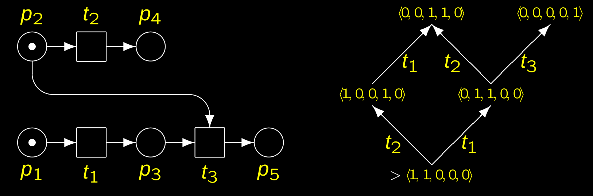

# Petri Nets
## Intro
Places(circles) and trasitions(boxes), connecteb by directed arcs.

Places may hold tokens, and can move tokens by "firing".

Transition is enabled if input places contains atleast as many tokens as input arc weight indicates.

$N=\big<P, T, F, W, M_0\big>$

* $P$ places
* $T$ transitions
* $F \subseteq (P \times T) \cup (T \times P)$ Place -> Transition -> Place
* $W$ weights: $W: F \rightarrow (\N \backslash \{0\})$ weights are nonzero natural numbers.
* $M_0: P \rightarrow \N$ initial token distribution.

$<p,t>\in F$ means $p$ input to $t$.

$a^* = \{a' | <a', a> \in F \}$ is the pre-set, all input places.\
$a^* = \{a' | <a, a'> \in F \}$ is the post-set, all output places.

$S = P$ notation wise.

Place capacity = max tokens.

$M(p)$ denotes tokens in place p.

### Fireing
* $t \in T$ is M-enabled $M \longrightarrow^t$ iff $\forall p \in t^* : M(p) \leq W(p,t)$ for all places in transition $t$, marking of p must be greater or equal to the arc weight to t.
* Successor marking $M'$ is written as $M \longrightarrow^t M'$. $\forall p \in P: M'(p) = M(p) - \overline{W}(p,t) + \overline{W}(t,p)$\
$\overline{W}$ defined as $\overline{W}(x,y) = W(x,y)$ for $<x,y> \in F$ else $\overline{W}(x,y) = 0$\
This makes $\overline{W}$ work for both $P \rightarrow T$ and $T \rightarrow P$.

### Reachability
$reach(M)$ smallest set of marking $M \in reach(M)$\
$M' \longrightarrow^t M''$ for $t \in T$, $M' \in reach(M)$ then $M'' \in reach(M)$\
Basically all valid markings.

$N=\big<P, T, F, W, M_0\big>$, $reach(N) = reach(M_0)$

The **reachability graph** of a net is a rooted graph $G=\big<V,E,v_0\big>$
* $V=reach(N)$ the set of vertices; each reachable marking is a vertex.
* $v_0 = M_0$ initial marking is root node.
* $E = \left\{ \left< M,t,M' \right> | M \in V \text{and } M \longrightarrow^t M' \right\}$ edge from marking to successor marking, where edge is labelled with fireing transition $t$.

This reachability graph represents all possible net states.\
\
Algo basically goes:
* Initialize graph, set work to initial marking.
* While work is not empty then for all transitions $t$ that are enabled for $M$, fire $t$ on $M$.
* If the new marking $M'$ is not in the vertex set, then add it and add it to the work.

### Graphs and automata
A marked set $\left<N, M_0\right>$ where $N = (P, T, Pre, Post)$\
Where $M_0$ is initial marking and rest are rules of evolutions.\
Net language is the set of sequences of transitions that can fire. $\{\sigma \in T^* | M_0[\sigma \big>\}$\
And the reachability set $\{M \in \N^{|P|}|(\exist \sigma \in L(N, M_0)) M_0[\sigma\big>M\}$\
Reachability graph is an automaton $G = (X, E, \delta. x_0)$ where
* $X = R(N, M_0)$ the states of automaton are reachable markings.
* $E = T$ events in alphabet are transitions.
* $\delta(M, t) = M' \Longleftrightarrow M[t\big>M'$ which is simply the state transition equivalent of the automaton arc label.
* $x_0 = M_0$ start state is initial marking.

k-bounded means that no marking ever exceeds k.

A transition $t \in T$ is quasi-live if it eventually fires $\sigma \in T^*$ and $M_0[\sigma t \big>$.

A transition is live if it eventually fires (in any reachable marking).

Net is quasi-live if all transitions are quasi-live.

A net is reversible if for any marking $M \in R(N,M_0)$ if it holds $M_0 \in R(N,M)$, aka it can reach start state from non-start state.

Partitioning in automaton into strongly connected components.
Transient -> there are outgoing edges in component.
Ergodic -> no outgoing edges in component.

#### Boundness
The bound $k_p$ in reachability graph is $\max M(p)$.\
The bound $k$ in reachability graph is $\max k_p$.

#### Liveness
$t$ is quasi-live -> t is in graph
$t$ is live -> t is in all ergodic components

#### Reversability
Is there a sequence of tansitions leading to $M_0$ from $M$

#### Covereability
Reachability can be infinite, coverability graph can show if it is infinite or not.

In $\omega$ marking, each place $p$ marking will have either $\omega$ (infinitely many) or $n \in \N$ tokens.

If place has $\omega$ tokens, it has sufficiently many tokens always.\
Fireing target will have $\omega$ tokens based on arithmatic rules.

$M'$ coveres $M$ as $M \leq M'$ iff $\forall p \ in P : M(p) \leq M'(p)$, basically if $M'$ has more tokens.

Stricly coveres means $M \leq M'$ and $M' \neq M$ (because arithmatic rules).

$M \rightarrow^t$ then $M' \rightarrow^t$ if $M \leq M'$, $\omega$ tokens enable all transitions.

$\Delta M$ denotes the place wise difference $\Delta M := M' - M$.\
$M'' = M' + \Delta M = M + 2 \Delta M$

We can pump an arbitary number of tokens to all places having a non-zero marking $\Delta M$.

To finalize we replace marking $M'$ with marking where all places with non-zero tokens in $\Delta M$ are replaced with $\omega$.\
Basically all places that change, will eventually contain a $\omega$.

Algorithm same as reachability, but when fired all $\Delta M$ places have $\omega$'s added to them.

$E*$ means some sequence of edge traversals is markings graph.

AddOmega algorithm:
* Given $(M, t, M', V, E)$
* For all possible markings $M'' \in V$ (remember $V$ is all possible markings).
* if $M'' < M'$ and $M'' \rightarrow_{E^*} M$; basically if $M''$ has more markings and there exists some path from $M''$ to $M$
* then $M' := M' + ((M' - M'') \cdot \omega)$

Basically for any marking does there exist a marking that strictly has more tokens?

Reversability in $\omega$ marking set $\mathcal{M}$, 

## Structural analysis
Reachability graph is exponential based on number of places (it may be infinite).\
Structural analysis makes this possible by the two main techniques:
* Place invariants
* Traps

### Indcdence matrix & vector
The matrix is given by $C_N: P \times T \rightarrow \Z$: rows = places, cols = transitions.\
Column $t \in T$ denotes how fireing of $t$ affects matrix $C(t,p) = W(t,p) - W(p,t)$.

Marking can be representated as matrix $M_0 = (1,0,0,1,1,0,0)^T$.\
Fireings can be expressed as vector also $u=(1,1,0,1,0,0)^T$ (t1, t2 and t4 fires).

Transition can be computed $M_0 + C \cdot u$.

Bi-directional arcs cancel out (0).

If we know a destination marking $M$ we can show that it may be unreachable $M_0 + C \cdot u = M, no natural solution to u.

### Invariants
The solution of $C \cdot u = 0$ called tranistion invariants, indicate possible loops.\
$u = (1,1)^T$ means loop (both transitions fire).

$C^T \cdot x = 0$ place invariants, proper place invariant is sol of $C^T \cdot x = 0$ if $x \neq 0$
#### P-invariants
$M$ reachable by fireing sequence $u$ such that $M=M_0 + C \cdot u$.\
If $x$ is p-invariant then $M^T x = M^T_0 x$.

A p-invariant where all entries are either 0 or 1 indicate a set of places in which the number of tokens remains unchanged in all reachable markings.

component wise addition or constant multiplication of invariant is still a p-invariant. Set of all invariants is a vector space.

P-invariants prove mutial exclusion properties.

Two places cannot be marked concurrently.

## Farkas algorithm
Can compute P-invariants.\
Computes minimal P-invariants, which means positive place invariants where all other positive invariant can be computed by linear combination.

Farkas needs worstcast exp time, since P/T net with exponential minimal P-invariants.

